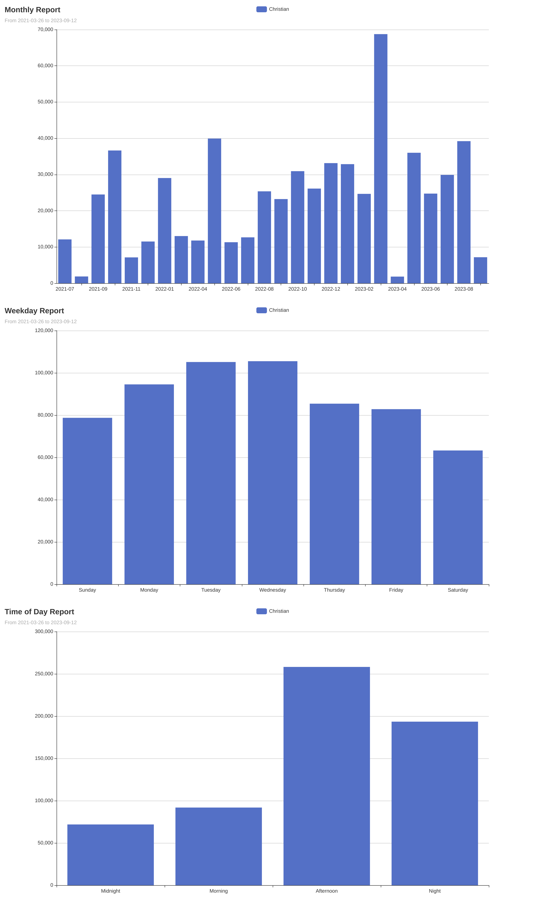

# Produgit CLI Tool



The Produgit CLI tool offers various commands for analyzing, reporting, and visualizing your git repositories.

## Requirements
- [Go](https://golang.org/): You will need Go installed to build and run this tool. You can download it from the [official Go website](https://golang.org/dl/).

## Install
```sh
go install github.com/christian-gama/produgit@latest
```


## Available Commands
| Command         | Description                                               |
|-----------------|-----------------------------------------------------------|
| `anomaly`       | Check what commits have a quantity of lines that may be considered an anomaly. |
| `config`        | Manage the produgit configuration. |
| `list`          | List general information like authors or repositories. |
| `plot`          | Plot the data from the report command. |
| `report`        | Generate a report of your produgit using a specialized git log. |

### Report
**Generate a comprehensive report of your git repositories.** This command lets you select specific directories, exclude patterns or directories, and even suppress the output for a quiet run. Several paths and extensions are excluded by default, such as node_modules, package-lock.json, etc. These paths can be edited any time using the `git config edit` command.

| Flag/Option     | Short | Default Value | Description |
|-----------------|-------|---------------|-------------|
| `--dir`         | `-d`  |               | Directories to include in the report. |
| `--output`      | `-o`  |               | Output file. |
| `--exclude`     | `-e`  |               | Patterns or directories to exclude from the report. |
| `--quiet`       | `-q`  |               | Quiet mode. Suppresses output. |

Example:
```sh
produgit report --dir "~/personal" --dir "~/work" --exclude "**path/to/ignore/*" --exclude "*.extension"
```

### Plot
**Visualize your git data in a variety of ways.** From monthly breakdowns to insights on top authors or languages, get a clear picture of your repositories' trends and activities. It's required to run the `produgit report` command first to generate the data for plotting.

| Flag/Option     | Short | Default Value | Description |
|-----------------|-------|---------------|-------------|
| `--input`       | `-i`  | (from config) | Input file. |
| `--start-date`  | `-s`  |               | Start date (Formats accepted: yyyy-mm-dd hh:mm, yyyy-mm-dd, yyyy-mm). |
| `--end-date`    | `-e`  |               | End date (Formats accepted: yyyy-mm-dd hh:mm, yyyy-mm-dd, yyyy-mm). |
| `--author`      | `-a`  | (from config) | Authors. |
| `--output`      | `-o`  | (from config) | Output file. |
| `--period`      | `-p`  |               | Period to plot (options: today, 24h, this_week, 7d, this_month, 30d, this_year, 1y). |

Subcommands within `plot`:
- `monthly`: Plot the monthly data.
- `time_of_day`: Plot the time of day data.
- `top_authors`: Plot the top authors data.
- `top_languages`: Plot the top languages data.
- `weekday`: Plot the weekday data.

Example:
```sh
produgit plot monthly --author "Foo" --author "Bar" -s 2023-09-12 14:15
```

### Config
**Keep your tool settings in check.** Modify or reset the tool's configurations as per your needs, ensuring the CLI adapts to your workflow.

| Command         | Description                                   |
|-----------------|-----------------------------------------------|
| `edit`          | Edit the produgit configuration.               |
| `reset`         | Reset the produgit configuration to its default values. |

### Anomaly
**Identify unusual commit behaviors.** Discover commits that contain a larger than usual quantity of lines. Great for spotting potential errors or oversized commits.

| Flag/Option     | Short | Default Value | Description |
|-----------------|-------|---------------|-------------|
| `--quantity`    | `-q`  | `3000`        | Quantity of lines to be considered an anomaly. |
| `--input`       | `-i`  | (from config) | Input file. |
| `--start-date`  | `-s`  |               | Start date (Formats accepted: yyyy-mm-dd hh:mm, yyyy-mm-dd, yyyy-mm). |
| `--end-date`    | `-e`  |               | End date (Formats accepted: yyyy-mm-dd hh:mm, yyyy-mm-dd, yyyy-mm). |
| `--authors`     | `-a`  | (from config) | Authors to be considered. |

Example:
```sh
produgit anomaly -q 5000 -s "2023-01-01" -e "2023-12-31"
```

### List
**Quickly access essential repository data.** Find out key contributors or get a list of all the repositories you're working with.

| Flag/Option     | Short | Default Value | Description |
|-----------------|-------|---------------|-------------|
| `--dir`         | `-d`  | `.`           | The starting directory to search for .git repositories. |

Commands within `list`:
- `author`: List authors of all repositories.
- `repos`: List all repositories.

---

To get a detailed help message for each command, use:
```sh
produgit [command] --help
```

## Config File

The Produgit CLI tool harnesses a configuration file to fine-tune and facilitate its functions. This file is automatically generated when the tool initializes, but you can also create or modify it manually for added customization.

### Example Config File:

```toml
quiet = false
authors = ["John"]

[plot]
output = "<chart>_<authors>_<date>.html"

[report]
exclude = [
    "**node_modules/*",
    # other paths
]
output = "path/to/your/report.pb"
```

### Configuration Breakdown:

| Section/Attribute | Type | Description |
|-------------------|------|-------------|
| `quiet`           | Boolean | Determines if the tool should run in a quiet mode. |
| `authors`         | Array of Strings | Lists default authors for tool operations. |
| `[plot]`          | Section | Contains configurations for the `plot` command. |
| `[plot].output`   | String | Specifies the naming format for plotting outputs. |
| `[report]`        | Section | Contains configurations for the `report` command. |
| `[report].exclude`| Array of Strings | Paths and patterns to be excluded in reports. |
| `[report].output` | String | Default location for generated reports. |

### Placeholders for Plot's Output:

The naming convention for plotting outputs can incorporate several placeholders. These will be replaced with their actual values during runtime.

| Placeholder      | Represents |
|------------------|------------|
| `<authors>`      | The authors involved. |
| `<date>`         | Current date of plot generation. |
| `<start_date>`   | Specified start date in the plot command. |
| `<end_date>`     | Specified end date in the plot command. |
| `<chart>`        | Type of chart or graph plotted. |
| `<timestamp>`    | Exact timestamp of plot generation. |

Using the example config, plotting a monthly chart for the author "John" on "2023-09-12" could produce a file named: `monthly_John_2023-09-12.html`.

## License

The Produgit CLI tool is licensed under the MIT License, which grants permission to use, modify, and distribute the software freely. The MIT License is one of the most open and permissive licenses available, often chosen for its simplicity and limited restrictions on reuse.

For detailed terms and conditions of the MIT License applied to the Produgit CLI tool, please refer to the [`LICENSE`](./LICENSE) file in the root directory of the project.
